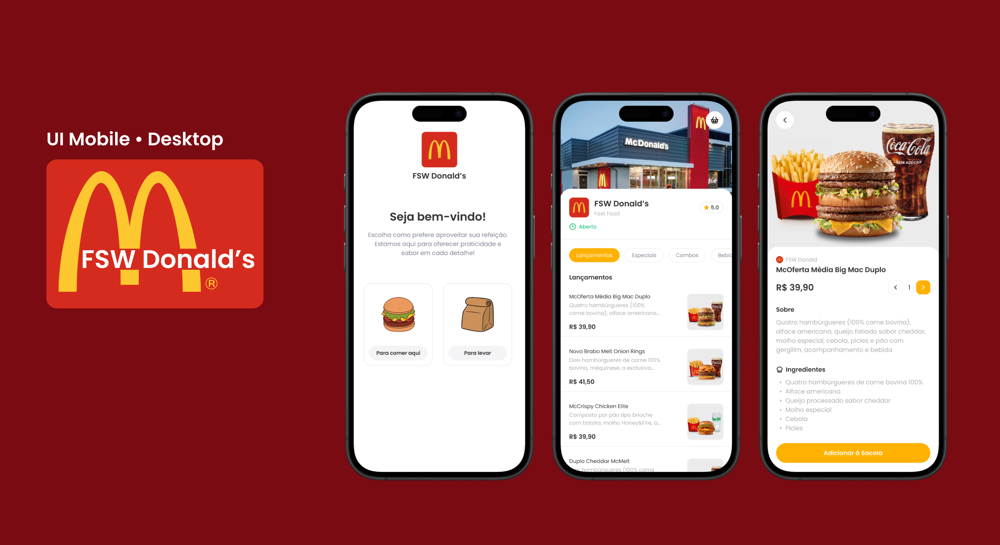

#  FSW Donalds

Este projeto foi desenvolvido durante a **Fullstack Week** promovida pela **Full Stack Club**. O objetivo é criar uma réplica que simula um sistema de pedidos de alimentos online, inspirado no processo de compra em um **totem de pedidos do McDonald's**, com funcionalidades focadas em uma experiência de usuário intuitiva, utilizando as tecnologias mais recentes do desenvolvimento Full Stack.

## 🚀 Tecnologias Utilizadas

### Frontend Technologies

### Backend 

### Database

## 🛠 Funcionalidades

- **Interface de pedido:** Interface intuitiva para selecionar itens do cardápio e realizar o pedido.
- **Totem de pedidos simulado:** Processo de pedido com categorias de produtos.
- **Sistema de gerenciamento de pedidos:**  Implementado, permitindo visualizar os pedidos.

## 🤝 Contribuições

Contribuições são bem-vindas! Para contribuir:

- **Abra uma Issue:** Relate um bug ou sugira uma melhoria.
- **Crie um Pull Request:** Faça alterações no código e envie uma solicitação para revisão.

## 📧 Contato

Para dúvidas ou feedback, entre em contato:

- **E-mail:** [nina.kastro@icloud.com](mailto:nina.kastro@icloud.com)
- **LinkedIn:** [LinkedIn](https://www.linkedin.com/in/karinacmartins/)
- **GitHub:** [GitHub](https://github.com/karinacmartins)

## Observações

Este projeto foi desenvolvido durante a Fullstack Week, uma imersão de 7 dias focada no aprendizado de tecnologias Full Stack.
Esta versão é otimizada para dispositivos móveis. Para uma melhor visualização em desktop, é necessário ajustar a configuração da interface.

 
 

  
Made with 💜 by <a href="https://github.com/karinacmartins">KM</a>.
